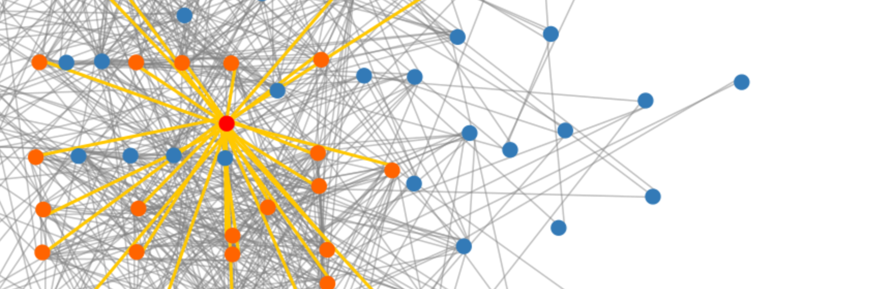

.. cob documentation master file, created by
   sphinx-quickstart on Sun Jan  7 18:09:10 2018.
   You can adapt this file completely to your liking, but it should at least
   contain the root `toctree` directive.

.. _overview:
.. currentmodule:: cob

COB - The Co-expression Browser
###############################

COB is a complete client/server package built to browse gene co-expression
networks created by `Camoco <https://github.com/LinkageIO/Camoco>`_. The client
is written in javascript, and the server is written in python.

A demo for COB is running at
`http://lovelace.cs.umn.edu/cob <http://lovelace.cs.umn.edu/cob>`_. 

Table of Contents
=================

.. toctree::
   :maxdepth: 2
   :caption: Sections:

    Installing COB <installation>
    Running COB <running>
    Configuration <config>
    Docker Containers <docker>
    Deploying COB <deploying>

Paper
=====

There is a publication for this updated version of cob in process. More
information will be added to this doc when it's available.

Acknowledgements
================

We would like to thank Dr. Chad Myers and all members of the Myers Lab for
their extensive feedback and input on this project. We also would also like to
thank Max Franz, for his assistance on getting PolyWas integrated with
Cytoscape.js. Finally, we would like to thank the participants of the 2019
Rocky Mountain Genomics HackCon for their feedback on this project.

Funding
=======
This work was supported by funding from the National Science Foundation
(IOS-1126950, IOS-1444503, and IOS-1450341), the USDA Agricultural Research
Service (5070-21000-039-00D), and the USDA National Institute for Food and
Agriculture (2016-67012-24841).
